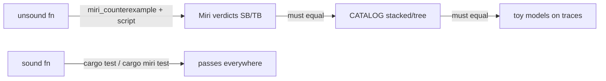

# ADR 0001: Miri-gated aliasing counterexamples

- **Status:** Accepted
- **Date:** 2026-10-02
- **Context module:** `src/unsafe_semantics/`

## Context

`src/unsafe_semantics/` teaches Rust's aliasing rules by example: each lesson is a
program with undefined behaviour (UB) under Stacked Borrows and/or Tree Borrows,
paired with its fix. That raises three problems:

1. **UB must never execute natively.** A normal `#[test]` that calls the UB half is
   itself UB: it may "pass", fail, or miscompile depending on the optimizer.
2. **A UB test cannot "expect failure" under Miri.** Miri aborts the whole process
   on UB, so `#[should_panic]` does not work and one UB test would kill the run.
3. **The interesting fact is the verdict per model** (SB vs TB), which needs two
   separate Miri runs with different `MIRIFLAGS`.

## Decision

- UB halves are `pub unsafe fn *_unsound() -> i32` with a `# Safety` section saying
  *never call this*. No test calls them.
- A `CATALOG` records, for each counterexample, Miri's verdict under both models.
- The `miri_counterexample` binary runs one counterexample by name. It **refuses to
  run a UB half unless `cfg!(miri)`**, and prints the catalog with `--list`.
- `scripts/miri-counterexamples.sh` runs every UB half in its own Miri process under
  SB and TB, classifies the result (`ok`, `ub` only if Miri printed
  "Undefined Behavior", anything else is an error), and fails on any mismatch.
- Sound halves and the toy SB/TB models are ordinary tests, so they run natively
  **and** under `cargo miri test` with both models.
- Each counterexample also carries a hand-written pointer trace; unit tests assert
  the toy models reproduce Miri's recorded verdicts. The script keeps the recorded
  verdicts honest against real Miri; the unit tests keep the models honest against
  the recorded verdicts.

## Consequences

- CI gains a nightly `miri` job; the stable jobs still never execute UB.
- Native coverage tools report the UB halves as unexecuted; they are covered only by
  Miri runs, which llvm-cov cannot see.
- Miri's verdicts can change as the models evolve on nightly; the script will flag
  that as a catalog mismatch, which is the desired signal.
