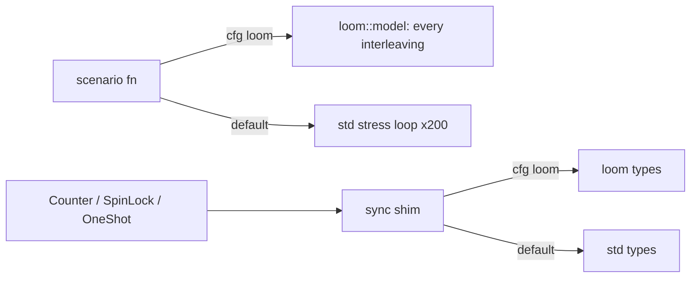

# ADR 0001: Gate Loom on a `cfg`, not a Cargo feature

**Date:** 2026-10-02
**Status:** Accepted

## Context

`src/testing_craft/loom_model.rs` model-checks small concurrent types (`Counter`, `SpinLock`,
`OneShot`) with [Loom](https://docs.rs/loom). Loom only works if the code under test uses
`loom::sync::atomic::*`, `loom::cell::UnsafeCell`, `loom::sync::Arc` and `loom::thread`
**instead of** std's, and loom's types panic when used outside `loom::model`.

So whichever switch selects loom changes the behaviour of the whole module, not just its tests.

## Decision

- A public `sync` shim module re-exports loom under `#[cfg(loom)]` and std otherwise. For
  `UnsafeCell`, the std branch is a thin wrapper exposing loom's closure API (`with`/`with_mut`)
  so one implementation compiles against both.
- `loom` is declared as `[target.'cfg(loom)'.dependencies]`, enabled with
  `RUSTFLAGS="--cfg loom"`. It is **not** a Cargo feature.
- `cfg(loom)` is added to `[lints.rust] unexpected_cfgs check-cfg`.
- Each concurrent scenario is a plain function run by `loom::model` under `cfg(loom)` and by a
  repeated std stress test otherwise.
- CI runs a dedicated `loom` job.

## Rationale

A Cargo feature would be switched on by `cargo test --all-features`, making every std-mode test
of these types use loom primitives outside a model and panic. This is the same reasoning as the
`nightly_portable_simd` cfg (PR #442): `--all-features` must stay safe on stable. `cfg(loom)` is
also the convention loom's documentation and the wider ecosystem (tokio, crossbeam) follow.

## Consequences

- `RUSTFLAGS` changes invalidate the build cache; the CI job and local runs use a separate
  target dir / cache key.
- Constructors in `loom_model` cannot be `const fn` (loom's are not), so the module allows
  `clippy::missing_const_for_fn`.

