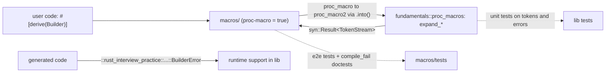

# ADR 0002: Proc-macro logic in the library, real macros in a thin shim crate

**Date:** 2026-10-02
**Status:** Accepted

## Context

`src/fundamentals/proc_macros.rs` drills procedural macros with `syn`, `quote` and
`proc_macro2`: derives with helper attributes, attribute macros, a `VisitMut` rewrite, and a
function-like macro with a custom `Parse`. Two constraints shape where that code can live:

- A `proc-macro = true` crate may export **only** macros (no traits, no helper fns), and it is
  compiled for the host, so it cannot be a module of this library.
- `proc_macro::TokenStream` panics outside a macro expansion, so code written against it
  cannot be unit tested; `proc_macro2::TokenStream` works anywhere.

The drill file also has to read like ordinary Rust for gittype practice, so it should contain
the real parsing and codegen, not a stub that forwards elsewhere.

## Decision

- All macro logic lives in `fundamentals::proc_macros`, written against `proc_macro2`. Each
  macro is a pair: `expand_*` returns `syn::Result<TokenStream>` (unit tested on tokens and
  error messages), and a wrapper turns `Err` into `compile_error!` tokens.
- The module and its `syn`/`quote`/`proc-macro2` dependencies are behind the
  `proc-macro-patterns` Cargo feature, like the other dependency-heavy fundamentals.
- The root `Cargo.toml` becomes a workspace (`members = [".", "macros"]`, `exclude = ["fuzz", "verified"]`)
  with a new member `macros/` (`rust-interview-practice-macros`, `proc-macro = true`). Each
  of its macros converts with `.into()` and calls the library wrapper.
- End-to-end tests (`macros/tests/expand.rs`) apply the real macros and run the generated
  code. `compile_fail` doctests in `macros/src/lib.rs` pin down the error paths.
- Runtime support the generated code needs (`Describe`, `BuilderError`) lives in the library
  and is named by absolute path (`::rust_interview_practice::fundamentals::proc_macros`),
  since proc macros have no `$crate`.

## Rationale

This is the standard layout for testable proc macros (e.g. `serde` / `serde_derive_internals`,
`thiserror` / `thiserror-impl`): token-level tests are fast and precise, and a small set of
end-to-end tests proves the output compiles and behaves. The alternative, a standalone
proc-macro crate holding all the logic, would move the drill out of `fundamentals/` and make
every test an end-to-end compile.

## Consequences

- `cargo test` at the root still tests only the root package (it is the workspace's default
  member). The shim crate is tested with `cargo test -p rust-interview-practice-macros`; CI
  runs both, and clippy runs with `--workspace`.
- `compile_fail` doctests only check *that* compilation fails. The exact messages and spans
  are asserted by the library's unit tests.
- The shim crate depends on the whole library (built for the host when cross-compiling). That
  is acceptable for a practice repo.

