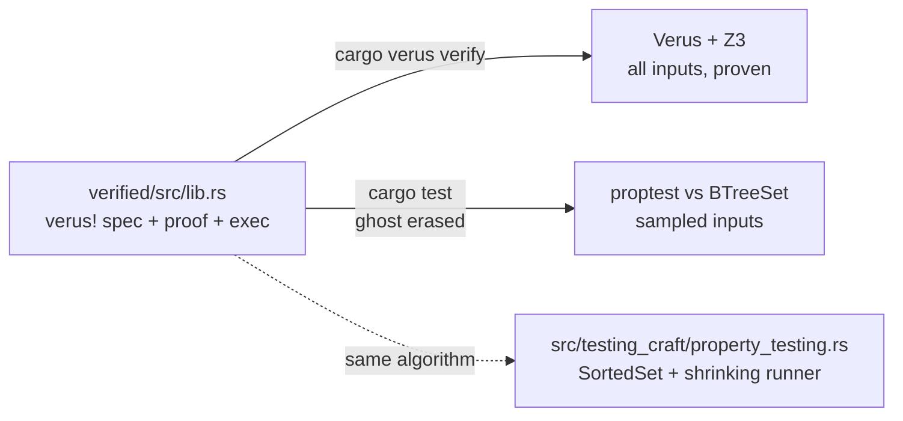

# ADR 0002: Verus proofs live in a separate `verified/` crate

**Date:** 2026-10-02
**Status:** Accepted

## Context

We want one small core (`SortedSet`) specified and proven with
[Verus](https://github.com/verus-lang/verus), with property tests running against the same
code. Verus code is written inside `verus! { ... }` and depends on `vstd`. Plain `rustc` can
compile it (ghost code is erased), but `cargo verus verify` processes every item in a crate
marked `verify = true`, and the Verus toolchain is pinned to a specific Rust version (1.98.1 for
release `0.2026.09.27.3cf1832`).

## Decision

- The verified code lives in `verified/`, its own crate and `[workspace]`, like `fuzz/`.
- `vstd` is pinned with `=` to the version listed in Verus's
  `cargo-verus/toolchain-manifests/<release>.toml`, and CI downloads exactly that release.
  The two versions are bumped together.
- The main crate does not depend on `verified/`. Its only always-on dependency stays
  `crc32fast`.
- Specs are stated against the abstract view (`Set<u64>` via `Seq::to_set`), never the `Vec`.
  The representation invariant `wf` is explicit (`requires`/`ensures`) rather than a
  `#[verifier::type_invariant]`, so the contract is visible when typing the file.
- `cargo test` in `verified/` runs proptests on stable Rust (ghost code erased); `cargo verus
  verify` runs the proofs. CI does both.

## Rationale

Marking the main crate `verify = true` would make Verus type-check roughly 2000 unrelated modules
and every optional dependency, all under the Verus toolchain pin. A separate crate keeps
verification fast and isolated, and keeps the main crate building on any recent stable Rust.

## Consequences

- Verus's mutable-reference model changed recently. Postconditions use `final(self)` for the
  post-state of `&mut self`, and `old(self)` for the pre-state.
- `rustfmt` does not format inside `verus!`. Use `verusfmt` if formatting matters.
- Upgrading Verus means picking a new release, copying its `vstd` version from the toolchain
  manifest, and re-running `cargo verus verify`.

