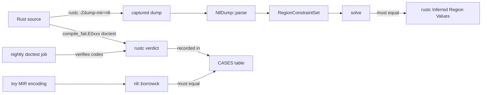

# ADR 0005: Keep `compiler_literacy` honest against real rustc output

**Date:** 2026-10-02
**Status:** Accepted

## Context

`src/compiler_literacy/` teaches reading MIR, NLL region constraints and borrowck errors. Notes
about compiler internals go stale quietly: the MIR text format, region numbering and even which
programs are accepted change between toolchains. A teaching module that is subtly wrong is worse
than none.

We also wanted the drills to be executable (typed out with gittype and tested), which means
modelling a borrow checker, and a model that only agrees with itself proves nothing.

## Decision

1. **Real dumps, not paraphrases.** `mir_reading` and `region_constraints` embed verbatim rustc
   1.97 output (`-Zunpretty=mir -Zmir-opt-level=0` and `-Zdump-mir=nll`, with spans and `DefId`s
   trimmed). Tests parse them and query facts (debug names, borrow sites, CFG edges).
2. **The region solver must reproduce rustc.** `NllDump::to_constraint_set` rebuilds the solver
   input from the dump's *Inference Constraints*; a test asserts our least fixpoint equals rustc's
   *Inferred Region Values* region by region. A seeded property test (via
   `testing_craft::sim_rng`) checks the worklist solver against the reachability specification
   on random constraint graphs with cycles.
3. **Every case study has three forms.** A real-Rust doctest (`compile_fail,E0xxx` when
   rejected), a fixed real-Rust function with unit tests, and a toy-MIR encoding.
   `borrowck_case_studies::CASES` records rustc's verdict next to each encoding and a test
   requires the mini checker (`nll::borrowck`) to produce exactly those error codes.
4. **Error codes are checked on nightly.** rustdoc ignores the `E0xxx` of a `compile_fail`
   doctest on stable, so CI gains a `doc-error-codes` job running
   `cargo +nightly test --doc -- compiler_literacy trait_dark_corners` with
   `RUSTDOCFLAGS=-Zpolonius=no`. Nightly defaults to the Polonius borrow checker
   (`-Zpolonius=next`), which accepts NLL problem case #3; the notes describe NLL because that
   is what stable ships, so the job pins it. The stable `test` job still runs every
   `compile_fail` doctest, so Polonius reaching stable fails CI there and prompts an update.
5. **The toy MIR is deliberately small.** References, positional structs and opaque blobs only;
   calls declare which arguments their result borrows from instead of carrying generic
   signatures. Everything rustc does that the cases need (location-insensitive outlives,
   reborrow constraints that stop at shared derefs, kills on overwrite, two-phase borrows,
   drop-liveness, shallow vs deep accesses, universal-region checks) is modelled by name.

## Consequences

- This job caught its first toolchain change on its first run: nightly 1.101 started accepting
  `get_default` (problem case #3). The note now records both verdicts.

- A toolchain upgrade that changes MIR printing or borrowck verdicts fails tests or the nightly
  doctest job instead of silently invalidating the notes. Refreshing a dump is: re-run the
  command in the module docs, paste, fix the expectations.
- The agreement test compares our verdicts with a hard-coded table; the table itself is only as
  good as the doctests that back it, which is why point 4 matters.
- Not modelled, and documented as such: Polonius, `#[may_dangle]`, mutability and
  move-path (initialization) checks, closures and generic signatures.

