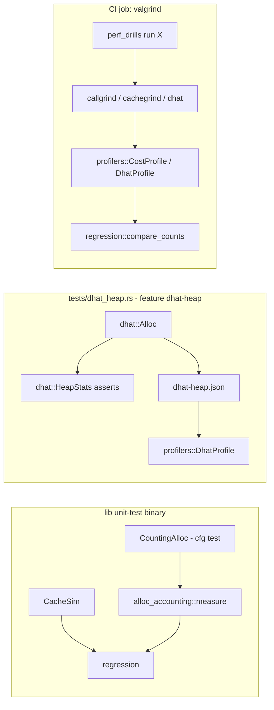

# ADR 0005: Where allocation accounting and profilers live

**Date:** 2026-10-02
**Status:** Accepted

## Context

`src/performance/` asserts on performance claims in ordinary unit tests. Wall-clock time is too
noisy for that, so the module relies on **deterministic counts** instead:

- heap activity (allocations, reallocations, bytes, peak) from a counting `GlobalAlloc`;
- simulated cache misses from `cache_locality::CacheSim`;
- real instruction counts, cache misses and heap blocks from Valgrind (callgrind, cachegrind,
  DHAT) and from `dhat-rs`.

Three of those need the process's single `#[global_allocator]` slot or an external tool, so
where each one is installed matters.

## Decision

1. **`CountingAlloc<System>` is the global allocator of the lib's unit-test binary only**
   (`#[cfg(test)] #[global_allocator]` in `alloc_accounting.rs`). Its counters are
   **thread-local** (`const`-initialized `Cell<u64>`s, which have no destructor, so they neither
   allocate nor re-enter the allocator), so `cargo test`'s parallel test threads don't pollute
   each other's measurements.
2. **`dhat-rs` is an optional dependency behind the `dhat-heap` feature**, used only by the
   integration test `tests/dhat_heap.rs` (`[[test]] required-features = ["dhat-heap"]`). It
   installs `dhat::Alloc` in that separate test binary.
3. **Valgrind is driven from a binary, not from tests.** `src/bin/perf_drills.rs` exposes each
   workload as `run <name>`, and `valgrind-check` profiles good/bad pairs under callgrind,
   cachegrind and DHAT, parses the output with `profilers::{CostProfile, DhatProfile}`, and gates
   them with `regression::compare_counts`. A dedicated CI job installs Valgrind and runs it.
4. Cachegrind runs with **pinned cache geometry** (`profilers::PINNED_CACHE_GEOMETRY`) so miss
   counts don't depend on the CI host's CPU.

## Rationale

- A `#[global_allocator]` in a library's non-test build would silently replace the allocator of
  every program that depends on it. `cfg(test)` scopes it to this crate's own unit tests.
  Doctests and binaries opt in by declaring their own (the `alloc_accounting` module doctest
  and `perf_drills` both do).
- A process can have only one global allocator, so `dhat::Alloc` can't coexist with the
  counting allocator in the lib test binary. A separate integration-test binary is the
  only clean place for it. A Cargo feature (not a cfg) is fine here because, unlike loom
  (ADR 0001), enabling it under `--all-features` changes nothing for the other test binaries.
- Valgrind runs a program 5-100x slower and is not installed everywhere. Making it a
  `cargo test` dependency would slow down or break the default suite. As a CLI subcommand it is
  opt-in locally and a single focused CI job.
- Cachegrind's default is to copy the host's cache sizes. Different runners would then report
  different miss counts for identical code, which defeats a count-based gate.

## Consequences

- Allocation counts are per thread: work a measured closure hands to another thread is not
  attributed to it (pinned by `test_counters_are_per_thread`).
- The counting allocator adds a thread-local increment to every allocation in the lib test
  binary. That cost is negligible next to the allocation itself.
- `dhat-rs` allows one profiler at a time, so `tests/dhat_heap.rs` is a single `#[test]` with
  sequential phases.
- Running end-to-end against real Valgrind output produced two lessons now in the docs: a
  naive transpose's misses are in `D1mw`, not `D1mr`; and presizing a `String` reduces heap
  blocks without reducing instructions. Gate each claim on the metric that actually shows it.

