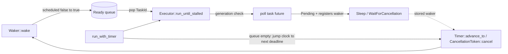

# Async Internals Drills Design

**Date:** 2026-10-02
**Status:** Implemented

## Overview

`src/async_internals/` rebuilds the machinery under `async`/`.await` by hand so it can be
practiced with gittype. `concurrency::async_executor` already shows a minimal channel-based
executor. This module splits the topic into five small, ordered drills. Each drill isolates
one mechanism and pins its invariants down with deterministic tests.

| # | File | Drill | Key invariant under test |
|---|------|-------|--------------------------|
| 1 | `raw_waker.rs` | `RawWakerVTable` by hand, `Wake` trait, `block_on` | waker refcount equals the number of live `Waker`s (no leak or use-after-free) |
| 2 | `future_polling.rs` | `Ready`, `YieldNow`, `Countdown`, `Map` (unsafe pin projection), `Join`, `async fn` desugaring | a `Pending` result always arranges a wake; the hand-desugared state machine needs the same number of polls as the compiler's version |
| 3 | `ready_queue.rs` | Single-threaded executor, `Spawner`, `JoinHandle`, abort | a task id is in the queue at most once; a wake during `poll` is never lost; stale ids never poll a reused slot |
| 4 | `timer.rs` | Virtual-clock `Sleep`, deadline heap, driver loop | timers fire in `(deadline, registration)` order; dropping a `Sleep` deregisters it |
| 5 | `cancellation.rs` | `CancellationToken` (children, `DropGuard`), `with_cancellation`, `timeout` | cancel wakes every waiter exactly once; the inner future is dropped eagerly on cancel or timeout |

## Data flow

## Decisions

- **Virtual clock.** `Timer` advances only when told to, so timer tests are instant and
  deterministic. A real runtime would use `std::time::Instant` and `park_timeout` instead.
- **Local (`!Send`) executor with a `Send + Sync` waker.** Task futures live in an
  `Rc<RefCell<..>>` slot table. Wakers only touch an `Arc<Mutex<VecDeque<TaskId>>>`, because
  the `RawWaker` contract requires thread-safe wakers even on a single-threaded executor.
- **Generational task ids.** A slot is reused only after its generation is bumped, so a
  leftover waker for a finished task cannot poll the new task in that slot.
- **Unsafe projection used once.** `Map` shows structural pin projection with a written
  safety argument. `WithCancellation` and `Timeout` box their inner future so the rest of
  the module stays safe code.
- **No new dependencies.** The module uses only `std` and builds on stable.

## Verification

- Every file has unit tests, including model-based tests seeded by a fixed xorshift
  generator: wake storms checked against a set model, and timer firing order checked
  against a sorted-vector model.
- `cargo +nightly miri test --lib async_internals` passes. Miri checks the hand-written
  vtables and the pin projection for undefined behaviour and leaks.
- `cargo clippy --all-targets -- -W clippy::pedantic -W clippy::nursery` reports no warnings
  for the module.
